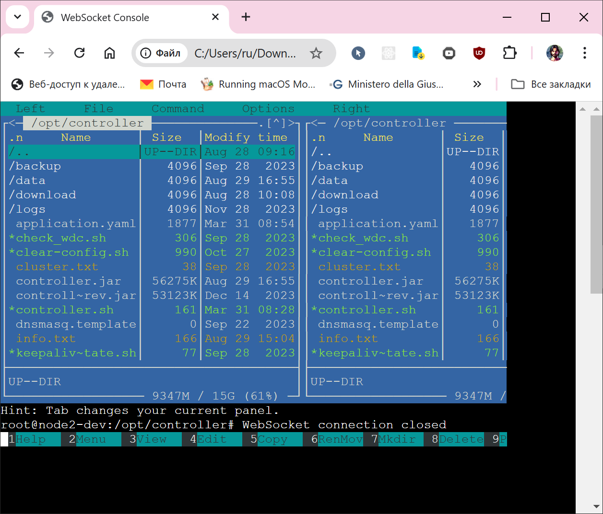

# ws-shell
WebSocket shell to process

This project provides a WebSocket server that launches a shell process and communicates with it through a WebSocket connection. It allows clients to interact with the shell via WebSocket messages.

## Compilation

To compile the `ws-shell` program, ensure you have the necessary libraries installed on your system. The following libraries are required:

- libc (`-lc`)
- libwebsockets (`-lwebsockets`)
- libssl (`-lssl`)
- libpthread (`-lpthread`)
- libcap (`-lcap`)
- libcrypto (`-lcrypto`)

### Installing Dependencies on Debian

Use the following command to install the required libraries on a Debian-based system:

```bash
sudo apt-get update
sudo apt-get install -y libwebsockets-dev libssl-dev libcap-dev build-essential make git
```

### Compiling the Program
```bash
git clone https://github.com/legale/ws-shell.git ws
cd ws
make
```

### Usage
To run the `ws-shell` server, use the following command syntax:
```sh
Usage: ./ws <port> <command> [keep_running_after_disconnect] [log_level]
  <port>    : Port number for WebSocket server
  <command> : Command to execute in PTY
  [keep_running_after_disconnect] : Optional, 0 or 1 (default: 0)
  [log_level] : Optional, log level (default: LLL_ERR | LLL_WARN: 3)
                insane log: 2047
                LLL_ERR | LLL_WARN | LLL_NOTICE | LLL_INFO log: 15
```

#### example 1
Start the server on port 7777 and run the bash shell:
```bash
./ws 7777 bash
Creating libwebsockets context
WebSocket server successfully bound to port 7777
WebSocket server for 'bash' started on port 7777
```

#### example 2
Start the server on port 7777, run the bash shell, and keep the server running after a client disconnects:
```bash
./ws 7777 bash 1
Creating libwebsockets context
WebSocket server successfully bound to port 7777
WebSocket server for 'bash' started on port 7777
```
#### example 3
Start the server on port 7777, run the bash shell, do not keep the server running after a client disconnects, and set the maximum debug log level:
```bash
./ws 7777 bash 0 2047
Creating libwebsockets context
[2024/08/29 18:50:18:3221] N: LWS: 4.1.6-, loglevel 2047
[2024/08/29 18:50:18:3224] N: NET CLI SRV H1 H2 WS IPV6-on
[2024/08/29 18:50:18:3226] I: lws_create_context: ev lib path /usr/lib/x86_64-linux-gnu
[2024/08/29 18:50:18:3227] I: Event loop: poll
[2024/08/29 18:50:18:3227] D: _realloc: size 6544: context
[2024/08/29 18:50:18:3229] D: _realloc: size 72: lws_smd_register
[2024/08/29 18:50:18:3230] D: lws_smd_register: registered
[2024/08/29 18:50:18:3231] D: _realloc: size 8388608: fds table
[2024/08/29 18:50:18:3479] I:  ctx:  5704B (1608 ctx + pt(1 thr x 4096)), pt-fds: 1048576, fdmap: 8388608
[2024/08/29 18:50:18:3480] I:  http: ah_data: 4096, ah: 976, max count 1048576
[2024/08/29 18:50:18:3480] D: _realloc: size 8388608: lws_lookup
[2024/08/29 18:50:18:3730] I:  mem: platform fd map: 8388608 B
[2024/08/29 18:50:18:3731] D: _realloc: size 840: event pipe wsi
[2024/08/29 18:50:18:3731] D: lws_role_transition: 0x5605b1e50a20: wsistate 0x200, ops pipe
[2024/08/29 18:50:18:3732] D: event pipe fd 4
[2024/08/29 18:50:18:3733] D: __insert_wsi_socket_into_fds: 0x5605b1e50a20: tsi=0, sock=4, pos-in-fds=0
[2024/08/29 18:50:18:3733] I:  Compiled with OpenSSL support
[2024/08/29 18:50:18:3734] I:  SSL disabled: no LWS_SERVER_OPTION_DO_SSL_GLOBAL_INIT
[2024/08/29 18:50:18:3734] I:  canonical_hostname = radar-prod1
[2024/08/29 18:50:18:3735] D: _realloc: size 712: lws_create_vhost
[2024/08/29 18:50:18:3735] D: _realloc: size 112: vhost-specific plugin table
[2024/08/29 18:50:18:3736] D: _realloc: size 24: same vh list
[2024/08/29 18:50:18:3736] I: Creating Vhost 'default' port 7777, 1 protocols, IPv6 on
[2024/08/29 18:50:18:3738] D: _realloc: size 840: listen wsi
[2024/08/29 18:50:18:3739] D: _lws_vhost_init_server: lws_socket_bind says 7777
[2024/08/29 18:50:18:3739] D: lws_role_transition: 0x5605b1e510e0: wsistate 0x200, ops listen
[2024/08/29 18:50:18:3740] D: lws_vhost_bind_wsi: vh default: wsi listen/shell, count_bound_wsi 1
[2024/08/29 18:50:18:3740] D: __insert_wsi_socket_into_fds: 0x5605b1e510e0: tsi=0, sock=5, pos-in-fds=1
[2024/08/29 18:50:18:3741] I:  Listening on port 7777
[2024/08/29 18:50:18:3741] I:  LWS_MAX_EXTENSIONS_ACTIVE: 1
[2024/08/29 18:50:18:3741] I:  mem: per-conn:          840 bytes + protocol rx buf
[2024/08/29 18:50:18:3742] I: lws_plat_drop_app_privileges: not changing group
[2024/08/29 18:50:18:3742] I: lws_plat_drop_app_privileges: not changing user
[2024/08/29 18:50:18:3743] D: lws_cancel_service
WebSocket server successfully bound to port 7777
WebSocket server for 'bash' started on port 7777
[2024/08/29 18:50:18:3745] D: _lws_state_transition: system: changed 1 'CONTEXT_CREATED' -> 2 'INITIALIZED'
[2024/08/29 18:50:18:3745] D: _lws_state_transition: system: changed 2 'INITIALIZED' -> 3 'IFACE_COLDPLUG'
[2024/08/29 18:50:18:3746] D: _lws_state_transition: system: changed 3 'IFACE_COLDPLUG' -> 4 'DHCP'
[2024/08/29 18:50:18:3746] D: _lws_state_transition: system: changed 4 'DHCP' -> 5 'CPD_PRE_TIME'
[2024/08/29 18:50:18:3746] D: _lws_state_transition: system: changed 5 'CPD_PRE_TIME' -> 6 'TIME_VALID'
[2024/08/29 18:50:18:3747] D: _lws_state_transition: system: changed 6 'TIME_VALID' -> 7 'CPD_POST_TIME'
[2024/08/29 18:50:18:3747] I: lws_state_notify_protocol_init: doing protocol init on POLICY_VALID
[2024/08/29 18:50:18:3748] I: lws_protocol_init
[2024/08/29 18:50:18:3748] D: _lws_state_transition: system: changed 7 'CPD_POST_TIME' -> 8 'POLICY_VALID'
[2024/08/29 18:50:18:3749] D: _lws_state_transition: system: changed 8 'POLICY_VALID' -> 9 'REGISTERED'
[2024/08/29 18:50:18:3749] D: _lws_state_transition: system: changed 9 'REGISTERED' -> 10 'AUTH1'
[2024/08/29 18:50:18:3749] D: _lws_state_transition: system: changed 10 'AUTH1' -> 11 'AUTH2'
[2024/08/29 18:50:18:3750] D: _lws_state_transition: system: changed 11 'AUTH2' -> 12 'OPERATIONAL'
[2024/08/29 18:50:18:3750] I: lws_state_transition_steps: CONTEXT_CREATED -> OPERATIONAL
```


### Demo screenshot with xterm.js

